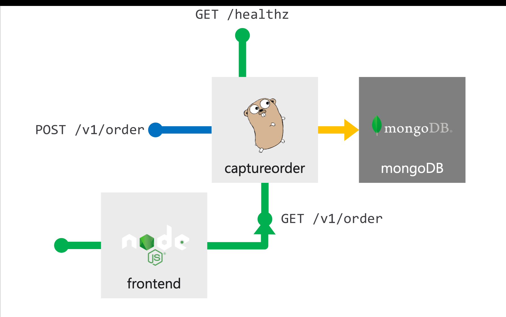

# The Azure Kubernetes Workshop (micro version)

Selected tasks from [The Azure Kubernetes Workshop](https://aksworkshop.io/)


# TOC

* [Building the Future 2020 LAB proctors](#building-the-future-2020-lab-proctors)
* [Description](#description)
* [Tasks](#tasks)
* [Recommended next steps](#recommended-next-steps)

# Building the Future 2020 LAB proctors

* [Ricardo Fiel](https://github.com/shoegazerpt) (Senior Cloud Solution Architect, Microsoft)
* [Henrique Graca](https://github.com/hjgraca) (Azure FastTrack Engineer, Microsoft)
* [Virgilio Esteves](https://www.linkedin.com/in/virgilioesteves/) (Microsoft Azure MVP and Architect at Sevenworld Technologies)

# Tasks

## Access the lab environment

Your proctors should present you a link to the environment.

## Access your cloud shell

Follow instructions in [../cloudshell.md](../cloudshell.md) to activate a cloud-based bash shell.

## Provision requirements

**In your cloud shell**, copy the Application/Client Id and Application Secret Key provided in your lab guide to environment variables as below:

```
appId=(paste from lab guide)
appSecret=(paste from lab guide)
```

Verify values are correct by typing:

```
echo $appId $appSecret
```

To provision the AKS cluster, run the following:

```
curl -s  https://raw.githubusercontent.com/shoegazerpt/btf-2020-labs/master/kubernetes/deploy.sh | bash -s $appId $appSecret
```

**NOTE:** This deploys to the first resource group in your subscription. To specify another resource group and location, pass it as parameters to command above. Eg: `bash -s <resource_group> <location>`

It may take up to 15 minutes to get the resources deployed and publicly available.

Take this time to continue reading the lab materials and get familiar with it.

## Overview

You will be deploying a customer-facing order placement and fulfillment application that is containerized and is architected for a microservice implementation.



The application consists of 3 components:

* A public facing Order Capture swagger enabled API
* A public facing frontend
* A MongoDB database

## Lab Steps

Start at [AKS Workshop - 2.2 Deploy MongoDB](https://aksworkshop.io/#db) and complete as many tasks as possible from "Getting Started".

# Recommended next steps

[The Azure Kubernetes Workshop](https://aksworkshop.io/)
